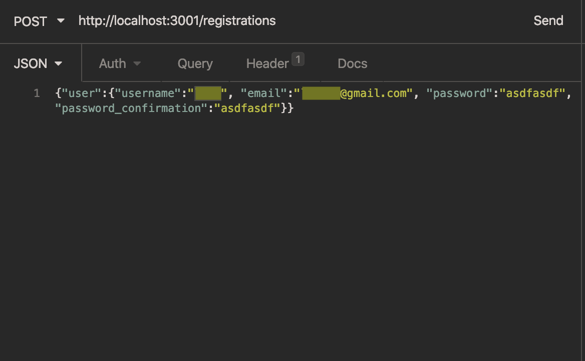
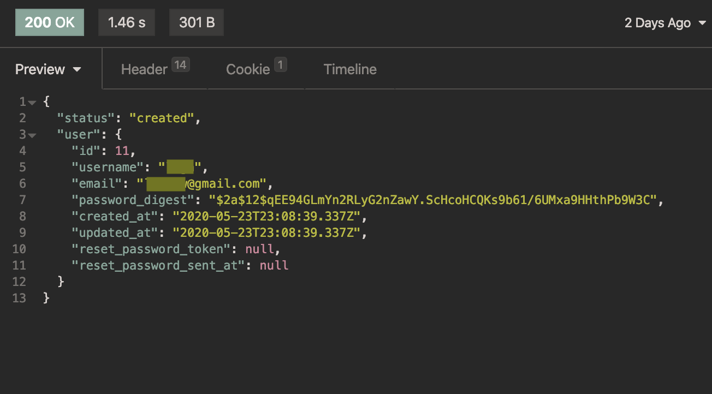
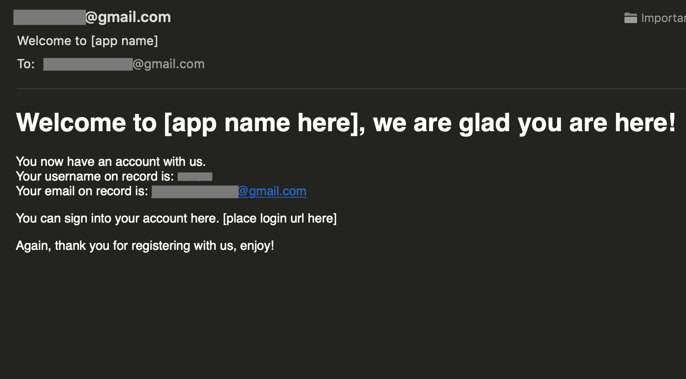
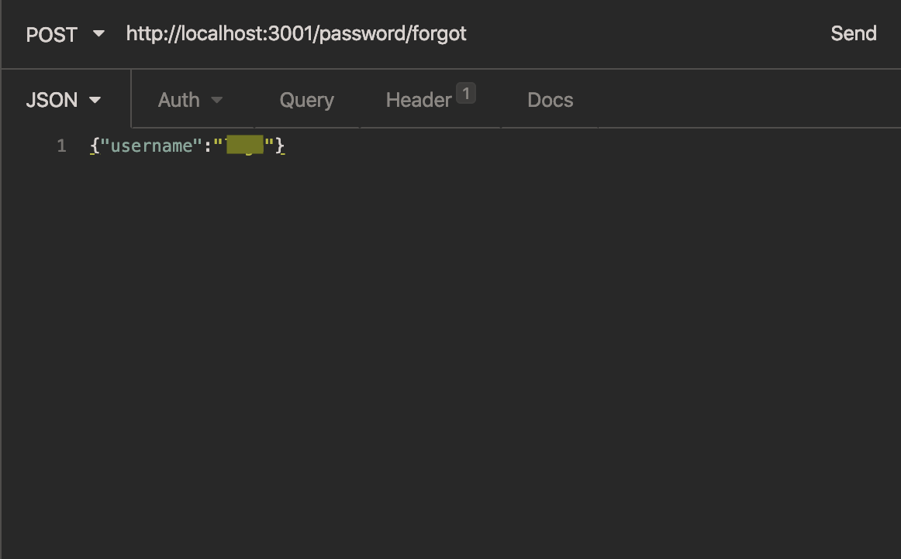
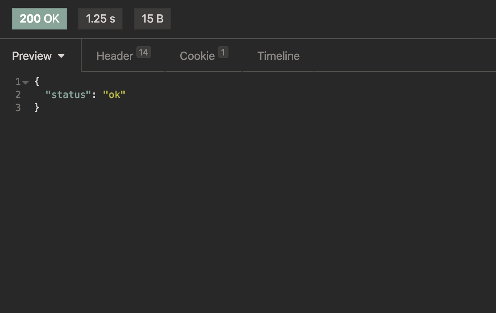
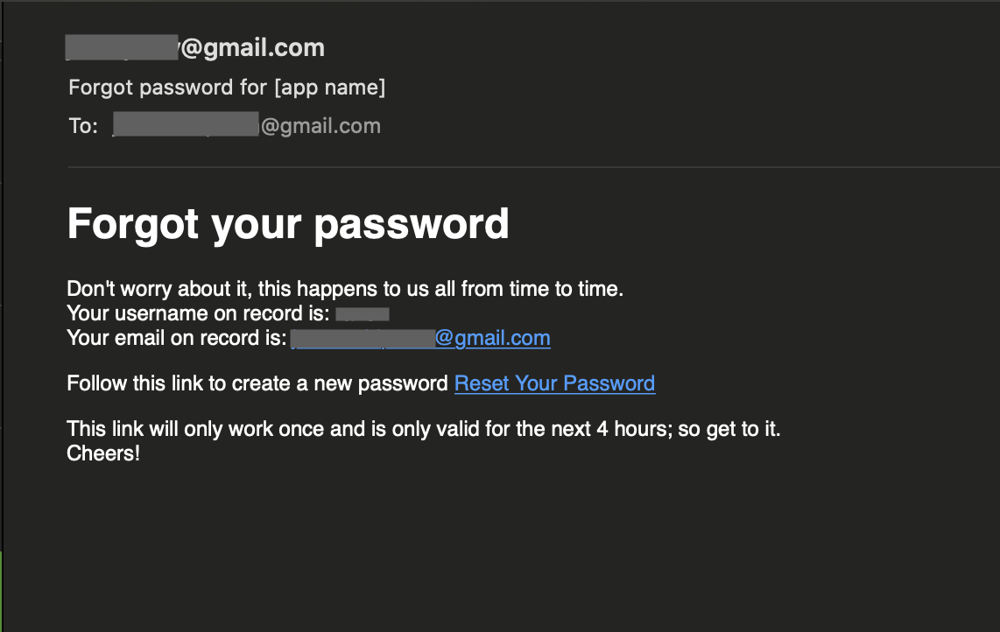
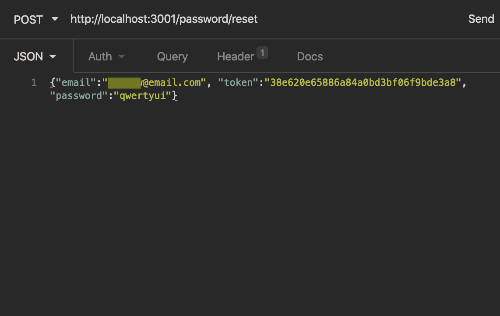
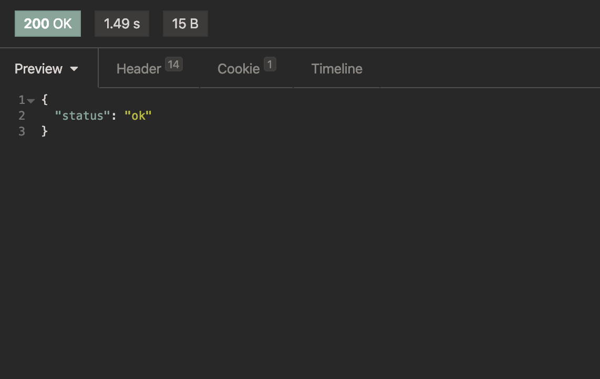
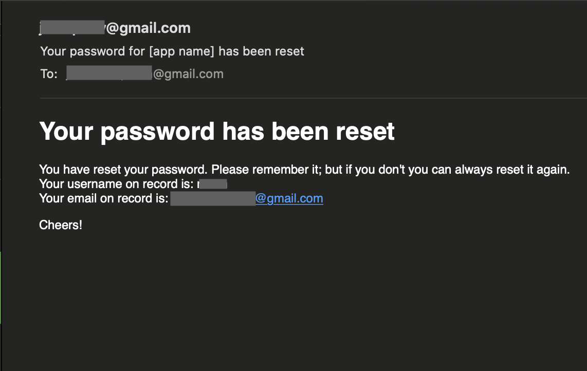
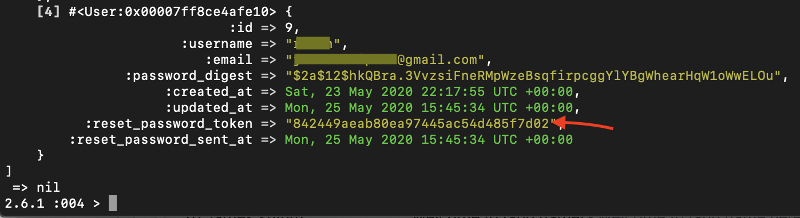

# Template_API

This readme can be used not just a reference for the template but also goes into details for how the user authentication works and why it is configured the way it is. It is very important to note that this all comes from a great youtube series from [Edutechnical HTTPS session cookies](https://www.youtube.com/playlist?list=PLgYiyoyNPrv_yNp5Pzsx0A3gQ8-tfg66j). The password reset and emailer functionality is adapted from two blog posts by Pascales Kurniawan, links to the posts are at the bottom of the readme.

## Update Log

_2020.06.11_

> Updated gemlock and yarn websocket-extensions to fix sercurity issues.

## Configuration

### Ruby version

2.6.1

### System defaults

- localhost port 3001 set within
  - \_api/config/initializers/cors.rb-ln7
  - \_api/config/puma.rb-ln13

#### Session Cookies for User Auth

- CORS setup with broad range of methods, can be customized per application's needs. File can be found here (\_api/config/initializers/cors.rb)

---

### Database initialization

`rails db:create` is all that is needed to create the initial databases. By default this will create a deveolpment and test database.

### User Model Configuration

- Used for user authentication

**User Model Creation**

```shellscript
rails g model User username email password_digest
```

> This generates a User model with a username, email and password; digest works with bcrypt and built in rails functionality to encrypt the string provided as the password.

---

**user.rb**

```ruby
  has_secure_password

  validates_presence_of :username, :email
  validates_uniqueness_of :username, :email

  def generate_password_token!
    self.reset_password_token = generate_token
    self.reset_password_sent_at = Time.now.utc
    save!
  end

  def password_token_valid?
    (self.reset_password_sent_at + 4.hours) > Time.now.utc
  end

  def reset_password!(password)
    self.reset_password_token = nil
    self.password = password
    save!
  end

  private

  def generate_token
    SecureRandom.hex(16)
  end
```

Default configuration is to enforce a unique username and email for each user that registers. Password tokens are generated as a random hex number 16 characters long; and a timestamp is created at the time of generation. That timestamp is used to compare against when the password is reset to ensure a timeframe inwhich the token is valid; in this template it is set to a 4 hour window but that can be changed.

---

**current_user_concern.rb**

This module creates a before action to be used universally that sets the current user to the user stored in sessions; allowing front-end pages to check the current user when needed.

```ruby
  extend ActiveSupport::Concern

  included do
    before_action :set_current_user
  end

  def set_current_user
    if session[:user_id]
      @current_user = User.find(session[:user_id])
    end
  end
```

**sessions_controller.rb**

Controlls user session creation, logging in and logging out.

```ruby
  include CurrentUserConcern

  def create
    user = User
      .find_by(username: params["user"]["username"])
      .try(:authenticate, params["user"]["password"])

    if user
      session[:user_id] = user.id
      render json: {
        status: :created,
        logged_in: true,
        user: user,
      }
    else
      render json: { status: 401 }
    end
  end

  def logged_in
    if @current_user
      render json: {
        logged_in: true,
        user: @current_user,
      }
    else
      render json: {
        logged_in: false,
      }
    end
  end

  def logout
    reset_session
    render json: { status: 200, logged_out: true }
  end
```

**registrations_controller.rb**

Handles the creation of a user account and wraps the json object in a user key. The json string for a user will look like the following. `{"user":{"username":"", "email":"", "password":"", "password_confirmation":""}}`

```ruby
  def create
    user = User.create!(
      username: params["user"]["username"],
      email: params["user"]["email"],
      password: params["user"]["password"],
      password_confirmation: params["user"]["password_confirmation"],
    )

    if user
      session[:user_id] = user.id
      render json: {
        status: :created,
        user: user,
      }
    else
      render json: { status: 500 }
    end
  end
```

#### API Endpoints / Routes

**routes**

```ruby
  # Routes for forgotten password
  post "password/forgot", to: "passwords#forgot"
  post "password/reset", to: "passwords#reset"

  # Create a User session
  # Create a new User via registration
  resources :sessions, only: [:create]
  resources :registrations, only: [:create]

  # Log a user out
  # Check to make sure a user is logged in
  # this is used when moving in the app
  # to check the user remains logged in
  delete :logout, to: "sessions#logout"
  get :logged_in, to: "sessions#logged_in"

  # Static page at root of api to make sure
  # server is running
  root to: "static#home"
```

---

**static_controller.rb**

```ruby
def home
  render json: { status: "It's working" }
end
```

> Render json status at server root for basic checking of function - i.e. is the server running.

---

**application_controller.rb**

```ruby
...
  skip_before_action :verify_authenticity_token
...
```

> Makes sure authentication token is verified before anything else.

### Forgotten password

Two posts from Pascales Kurniawan are my sources that helped me build a password reset process including send out emails for a welcome, password reset and a reset confirmation.

It starts with creating a passwords controller, there's a lot here but we will go through it all.

**passwords_controller.rb**

```ruby
  def forgot
    # check first if email exists, neede d because
    # though email is required to register, non-templated app
    # may allow for email to be removed by user later
    if params[:username].blank?
      return render json: { error: "Username not present" }
    else
      # find user by email
      user = User.find_by(username: params[:username])
    end

    # if present then generate a token
    if user.present?
      user.generate_password_token!

      # send out email
      UserMailer.forgot_password(user).deliver_now

      render json: { status: "ok" }, status: :ok
    else
      render json: { error: "Email address not found. Please check and try again." }, status: :not_found
    end
  end

  def reset
    token = params[:token].to_s

    if params[:email].blank?
      return render json: { error: "Token not present" }
    else
      user = User.find_by(reset_password_token: token)
    end

    if user.present? && user.password_token_valid?
      if user.reset_password!(params[:password])
        render json: { status: "ok" }, status: :ok

        # send email
        UserMailer.password_reset(user).deliver_now
      else
        render json: { error: user.errors.full_messages }, status: :unprocessable_entity
      end
    else
      render json: { error: "Link not valid or expired. Try generating a new link." }, status: :not_found
    end
  end
```

The `forgot` method starts by checking if the username params is blank or not. There are no views setup in this api, but this covers a use case of leaving the username field blank but still clicking on a submit button.

If the username is found then a password toekn is generated - that method is in the user model - and send an email. Email will be covered later. Finally if the user does not have an email on record then an error is passed forward. This is also an anticapated failsafe, but not one that is needed as is for the template. This is because email is required in the template api, a new user won't be created without one.

The `reset` method functions very similar to the `forgot` method. This first takes the token that is sent in the email (more on this later) and takes it back as a param. If the email is blank (again, from frontend params, no views are created but the checks are in place) then it passes an error.

A check for both a present user _and_ a valid token allows the password to be reset from a given param and then send an email confirming the email has been changed.

### Emails

To send emails from a rails backend you start by creating a mailer like a controller.

`rails g mailer UserMailer`

In the `_api/app/mailers/application_mailer.rb` file there is a change to be made. This is one of the places that follow that will not work right out of the box in this api. I tested everything with an email setup I created for myself and removed that information. It's a simple process of creating a new gmail account that can be used.

**application_mailer.rb**

```ruby
  default from: "create-a-new-email@gmail.com"
  layout "mailer"
```

Lets start with what needs to be configured in `_api/config/environments/development.rb`. Add the below to the file; this configures the development environment for gmail and sending emails.

**development.rb**

```ruby
  # Don't care if the mailer can't send.
  # Comment out the below as it is used again
  # if email is not needed in your app uncomment this one
  # config.action_mailer.raise_delivery_errors = false

  config.action_mailer.perform_caching = false

  # configuration for sending out welcome email from Gmail
  config.action_mailer.delivery_method = :sendmail
  # config.action_mailer.delivery_method = :test
  config.action_mailer.default_url_options = { :host => "http://localhost:3001/password/reset" }
  config.action_mailer.perform_deliveries = true
  config.action_mailer.raise_delivery_errors = true
  config.action_mailer.default_options = { from: "create-a-new-email@gmail.com" }
  config.action_mailer.delivery_method = :smtp
  config.action_mailer.smtp_settings = {
    address: "smtp.gmail.com",
    port: 587,
    domain: "gmail.com",
    user_name: "create-a-new-email@gmail.com",
    password: "password",
    authentication: "plain",
    enable_starttls_auto: true,
  }
```

**email views**
These are simple `html.erb` files and `text.erb` files. They are all in the user_mailer folder within the views folder of the rails app. There is a view that corresponds with each method in the `_api/app/mailers/user_mailer.rb` file. Those methods create the email header; the views files create the email body.

_forgot_password.html.erb_

```shellscript
<h1>Forgot your password</h1>
<p>
  Don't worry about it, this happens to us all from time to time.<br />
  Your username on record is: <%= @user.username %><br />
  Your email on record is: <%= @user.email%>
</p>
<p>
  Follow this link to create a new password <%= link_to "Reset Your Password",
  ('http://localhost:3001/password/reset?token='+@user.reset_password_token) %>
</p>
<p>
  This link will only work once and is only valid for the next 4 hours; so get
  to it. <br />
  Cheers!
</p>
```

> This specific view is important because it shows how to embed the reset token into the link back to server so the user never has to see or interact with the token.

## Deployment

The only steps needed to deploy this template api are as follows:

1. fork the repo in GitHub
2. clone it to your local system - allow the template to be the root of your backend, you can rename it as needed
3. run `bundle` from api root

That is it. The api is set and ready to go. You can start up the server and test the functionality after you update smtp settings to an email you want to test with.

## Testing

### Sessions Testing

In Terminal,

1. Start rails server (per template config it will run on port 3001)
2. New Terminal Tab type the following:

```shellscript
curl --header "Content-Type: application/json" \
--request POST \
--data '{"user":{"username":"ronkilav", "email":"ronkilav@email.com","password":"asdfasdf"}}' \
http://localhost:3001/sessions
```

> It is just easier to type this in Terminal than to try to test api with an application like Postman or Insomnia. The backslash is just to allow multiple lines in Terminal.

Server response if configuration is correct:

```shellscript
{"status":"created",
"logged_in":true,
"user":{"id":1,"username":"ronkilav","email":"ronkilav@email.com",
"password_digest":"$2a$12$Fj6ZBybAM15mNdQYeuSzceiKXwH5Knl0VTNmfuU9BxQzyY9yBnncK",
"created_at":"2020-05-19T20:45:58.288Z",
"updated_at":"2020-05-19T20:45:58.288Z"}}
[16:06:22]
```

> Output is actually on a single line, I placed it on multiple lines for readablity.

### Forgotten Password Testing

To test the process for reseting a password (and the emailing functionality) use a program like insomnia or postman; or modify the above curl command that checks if there is a user stored in sessions.

For password reset test I used insomnia and will include screenshots of the three POST requests needed for full testing.

To test the full process start by creating a new user. This can be done in a rails console but doing so will bypass the `registrations_controller.rb` and therefore the email process. So in insomnia create a POST request with all the needed new user information.

As long as you setup the email services first before these tests then you will get an email after registering a new user, requesting a new password and after setting a new password.

You will need rails console to get the reset token to add to the reset post request, but with a frontend or a set of views built out it will pass that token along as needed.

_new user POST_



_new user POST response_



_new user welcome email_



_forgot password POST_



_forgot password POST response_



_forgot password email_



_password reset POST_



_password reset POST response_



_password reset email_



_password reset token from rails console_


## Links and resources

_italic bullet points to be made after forking this template_

- _[GitHub Repo]()_
- _[Design Docs]()_
- _[ERModel link]()_
- _[Project Blog]()_
- _[Project Demo]()_
- [Edutechnical HTTPS session cookies](https://www.youtube.com/playlist?list=PLgYiyoyNPrv_yNp5Pzsx0A3gQ8-tfg66j)
- [Password Reset](https://medium.com/binar-academy/forgot-password-feature-on-rails-api-8e4a7368c59)
- [Sending Email](https://medium.com/@pascales/welcome-email-for-new-user-using-action-mailer-becdb43ee6a)
